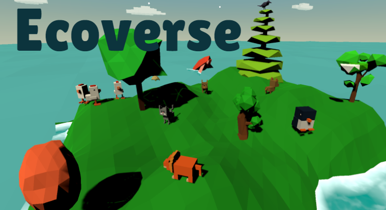

# Ecoverse (CS4240 Group Project AY2020/21 Semester 2)

Ecoverse is a simulator that aims to teach you the environmental impacts of the small choices you might make throughout the day. Depending on these choices, you would be transported into a world that could exist 50 years from now, because of your daily actions. So, will you make or break mankind's future?

Download the [release](https://github.com/jessicax941/cs4240-project/releases/tag/v1.0) to try it out (runs on HTC Vive or even your laptop/desktop)!

Check out video demo: https://youtu.be/oRDiihSxanI
 
Link to project on STEPS: https://uvents.nus.edu.sg/event/18th-steps/module/CS4240/project/5
